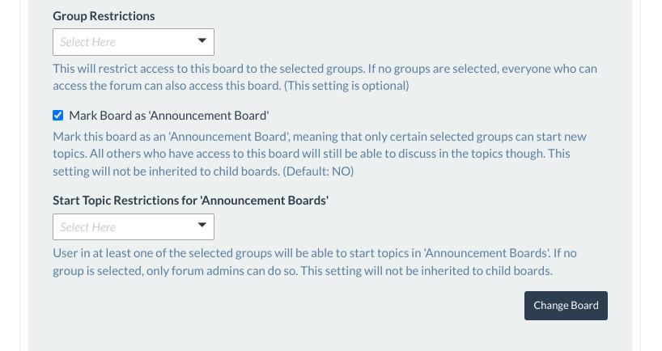

# Change Log

All notable changes to this project will be documented in this file.

The format is based on [Keep a Changelog](http://keepachangelog.com/)
and this project adheres to [Semantic Versioning](http://semver.org/).


## [In Development] - Unreleased


## [1.10.0] - 2022-08-03

### Fixed

- HTML syntax (missing mandatory label tag in global search form added)
- CSS classes in forms

### Added

- "Required Fields" hint to the forms that were missing it

### Changed

- "New Category" form in admin page visually enhanced
- Contribution guidelines updated
- CSS modernized
- App CSS and JS moved to bundled HTML templates
- Minimum requirements:
  - Python >= 3.8
  - Alliance Auth >= 2.15.1
  - Django ckEditor >= 6.4.2

### Removed

- Unused template tags
- Tests for Alliance Auth Beta
- Deprecated `type` parameter from `script` tags
- Deprecated `type` parameter from `style` tags


## [1.9.0] - 2022-07-11

### Changed

- Package discovery for setuptools
- SumoSelect library moved to its own bundled templates
- Minimum Requirement:
  - Alliance Auth >= 2.14.0


## [1.8.1] - 2022-06-26

### Fixed

- A CSS class in an image HTML tag
- Return dummy ID when user is not in an alliance
- No default alliance for test fake user

### Added

- Image sizes to the character portrait image HTML tags
- Error message when submitting an invalid form on topic creation
- Better error messages for topic reply errors

### Changed

- Templates cleaned up


## [1.8.0] - 2022-04-14

### Added

- New Feature: Announcement Boards
  
  - Boards marked as "Announcement Boards" have restrictions on who can start a topic
    in them. This is the already known group restriction function that is already
    used to restrict access to boards in general
  - Users with access to an announcement board still can discuss the topic itself
  - To start a topic, a user needs to be in (at least) one of the defined groups that
    are allowed to start topics
  - If no groups are defined that are allowed to start topics in the announcement
    board, only users with the `manage_forum` permission (Forum Admins) can start topics
  - These settings will not be inherited in child boards


## [1.7.0] - 2022-03-02

### Added

- Test suite for AA 3.x and Django 4

### Changed

- Switched to `setup.cfg` as config file, since `setup.py` is deprecated now

### Removed

- Deprecated settings


## [1.6.0] - 2022-02-28

### Fixed

- Compatibility Fixes (AA 3.x / Django 4):
  - ImportError: cannot import name 'ugettext_lazy' from 'django.utils.translation'
  - URL config in README updated to work with Django 4. **Please make sure to update
    your configuration accordingly!**


## [1.5.1] - 2022-01-26

### Fixed

- Escaped HTML entities in webhook messages, so that this »`That&#39;s`« does not
  happen anymore


## [1.5.0] - 2022-01-24

### Added

- Option: Use this Discord Webhook for replies as well? (This is a checkbox in the
  board settings. When checked, the provided Discord webhook will also be used to
  send a message for every reply in this board to Discord. Chose wisely!)

  

### Changed

- Webhook handling changed to dhooks-lite, so we can make our Discord messages nicer


## [1.4.3] - 2022-01-24

### Fixed

- `NoReverseMatch` error when slugs for a category, board or topic that are generated
  from the name/subject ended up being empty when only entered special chars like
  "@#$%" as name/subject


## [1.4.2] - 2022-01-23

### Fixed

- Deleting the last topic of a child board results in a `NoReverseMatch` error on
  the index page (Thanks @ErikKalkoken)

### Changed

- Refactoring of logic for updating first and last message on board and topic
  (Thanks @ErikKalkoken)
- Demoted `Board.update_last_message()` and `Topic.update_last_message()` to private
  methods. Those should no longer be called from outside the module, because they
  are called implicitly by `save()` and `delete()` when needed. Except for bulk
  methods, where e.g. `save()` is not called automatically. Test now also no longer
  test this method directly. (Thanks @ErikKalkoken)


## [1.4.1] - 2022-01-19

### Changed

- JavaScript: Some `let` vs. `const` slipped through the cracks and now have been fixed


## [1.4.0] - 2022-01-12

### Added

- Tests for Python 3.11

### Fixed

- Some JS fixes
  - Removed unused parameters and variables
  - Changed `let` to `const` where appropriate
  - Set `containment` option to category drag and drop


## [1.3.0] - 2021-12-28

### Added

- Tests for model names

### Changed

- Now using jQuery UI provided by Alliance Auth
- Minimum dependencies:
  - Alliance Auth>=2.9.4

### Fixed

- Posts in child boards were not considered for possibly being the latest post (#78)


## [1.2.1] - 2021-12-01

### Changed

- Model signals moved to their own file

### Fixed

- Discord webhook configuration for child boards


## [1.2.0] - 2021-11-30

### Changed

- Minimum requirements
  - Python 3.7
  - Alliance Auth v2.9.3
  - Django ckEditor v6.2.0
  - Alliance Auth App Utils v1.8.2
  - Unidecode v1.3.2


## [1.1.3] - 2021-10-31

### Changed

- Minimum version for `allianceauth-app-utils` set to 1.8.1


## [1.1.2] - 2021-09-28

### Fixed

- A potential issue with one of our template tags


## [1.1.1] - 2021-09-18

### Fixed

- An issue where JavaScript and CSS could have been posted in a message


## [1.1.0] - 2021-09-13

### Added

- Optional Discord webhook configuration to boards to send messages to your Discord
  via a webhook to notify a channel about new topics created in the board


## [1.0.3] - 2021-09-10

### Added

- More details to the admin views

### Fixed

- An issue with unicode characters in category, board or topic names


## [1.0.2] - 2021-09-05

### Fixed

- Admin models are now read-only, to prevent users from creating new entries via the
  Django admin backend, which will cause issues (see issue #47)


## [1.0.1] - 2021-08-31

### Changed

- Default sort order for new categories and boards moved to a constant

### Fixed

- Marked `forum_board_new_topic` as internal URL to prevent conflicts with a possible
  topic called "New Topic"
- Error 500 when trying to create a new topic with the exact same name of a topic
  that already exists in this board


## [1.0.0] - 2021-08-21

### Changed

- Moved from Beta to Stable


## [0.1.0-beta.18] - 2021-08-13

### Fixed

- "Copy message link to clipboard" button should always be visible ...


## [0.1.0-beta.17] - 2021-08-13

### Added

- "Copy message link to clipboard" button to messages in topic view

### Removed

- Image lightbox, it breaks images that have a hyperlink


## [0.1.0-beta.16] - 2021-08-04

### Changed

- Group restrictions are now alphabetically ordered

### Fixed

- Lowering SQL query count in Board view


## [0.1.0-beta.15] - 2021-08-04

### Changed

- Users with the `manage_forum` permission can now see all boards and topics, so
  they can actually manage the forum. With that said, choose wisely who gets this
  permission!


## [0.1.0-beta.14] - 2021-08-02

### Fixed

- Mobile view


## [0.1.0-beta.13] - 2021-07-25

### Fixed

- Key in setup.py


## [0.1.0-beta.12] - 2021-07-25

### Updated

- Configuration instructions in README.md to make it easier to understand if you
  have multiple apps that use CKEditor, like `aa-bulletin-board`, and how to combine
  these configurations


## [0.1.0-beta.11] - 2021-07-24

### Changed

- Moved "Modify Topic Subject" button to a better location


## [0.1.0-beta.10] - 2021-07-20

### Fixed

- Order of some bootstrap classes and some CSS


## [0.1.0-beta.9] - 2021-07-19

### Added

- "Show all unread topics" and "Mark all topics as read" buttons above the category
  list in forum index
- "Mark all topics as read" in unread topics view above and below board list
- More logging
- Access check when someone tries to reply to a topic they lost access to while viewing

### Removed

- Arbitrary `user_has_access` function from `Message` model


## [0.1.0-beta.8] - 2021-07-18

### Added

- Unread topics functionality to list all unread topics for the current user


## [0.1.0-beta.7] - 2021-07-17

### Added

- Child boards (1 Level). Child boards will inherit their access restrictions from
  their parents.


## [0.1.0-beta.6] - 2021-07-16

### Fixed

- [Bootstrap] CSS class moved to the right element


## [0.1.0-beta.5] - 2021-07-15

### Changed

- CKEditor config changed to prevent possible collisions in static files (see
  [Readme](README.md) for details)


## [0.1.0-beta.4] - 2021-07-14

### Added

- Ability to change the subject of the topic (User need to be the original poster or
  forum admin to change a topic's subject)

### Changed

- Link to a message now has the full path (category, board and topic) in its URL

### Fixed

- When the first message is deleted, the topic will be deleted as well. This is to
  prevent having topics with replies to a message that does no longer exist.


## [0.1.0-beta.3] - 2021-07-07

### Added

- YouTube embed plugin for CKEditor

### Changed

- Default config for CKEditor (see [Readme](README.md) for details) to implement the
  YouTube embed plugin and to remove the obsolete Flash embed


## [0.1.0-beta.2] - 2021-07-05

### Changed

- Setup classifier and pyupgrade check, since we aim to support AA 2.8.x with its
  current minimum Python version of 3.6


## [0.1.0-beta.1] - 2021-07-04

## \o/ FIRST PUBLIC BETA \o/

### Added

- Title attribute to last message in forum index
- "Mark all messages as read" button to forum index
- Counter for unread topics on forum link in navigation


## [0.0.1-alpha.11] - 2021-06-28

### Fixed

- `Topic.MultipleObjectsReturned: get() returned more than one Topic -- it returned 2!`
  when a board was restricted to more than 1 group


## [0.0.1-alpha.10] - 2021-06-28

### ⚠️ Migration Reset ⚠️

**Before** you update to this version, run the following command:

```shell
python manage.py migrate aa_forum zero
```

**After** you updated run:

```shell
python manage.py migrate aa_forum
```

### Added

- Unread messages functionality
- Version to static files to break browser caches on version updates
- New topic view now also has the bread crumb navigation
- Ability to create new boards with a new category
- Clear form button in forms that need it

### Changed

- Search function behavior. Up until now, the search function was looking for the
  whole search phrase, which is not the desired behavior. Now it checks if at least
  one word of the search phrase is in the message. This might give you more results
  but also doesn't miss the result you were looking for.
- Slugs consolidated
- Internal URLs reworked
- Pagination URLs reworked

### Fixed

- Appearance for multi select dropdown when dark mode is used


## [0.0.1-alpha.9] - 2021-06-17

### Added

- Search functionality

### Fixed

- A bug that prevented the forum index to load after removing a message or even a topic


## [0.0.1-alpha.8] - 2021-06-16

### ⚠️ Migration Reset ⚠️

**Before** you update to this version, run the following command:

```shell
python manage.py migrate aa_forum zero
```

**After** you updated run:

```shell
python manage.py migrate aa_forum
```

### Added

- SQL script to drop all tables

### Changed

- Improved model design for better data consistency, performance and compliance with
  Django conventions
- Improved queries to reduce page load time for all main views


## [0.0.1-alpha.7] - 2021-06-14

### Added

- Warning when replying on locked topics
- "Re:" on last message subject on forum index, if the last message in this board
  isn't the last message in the respective topic

### Fixed

- After creating a new topic, the user now returns to the newly created topic
  instead of the board view
- Vertical alignment of the topic names in board view


## [0.0.1-alpha.6] - 2021-06-13

### Fixed

- Date and time format in the message header
- The editor now uses the space it has and doesn't sit in its corner any longer
  Add the following to your `local.py`
  ```python
  CKEDITOR_CONFIGS = {"default": {"width": "100%", "height": "45vh"}}
  ```
- Lightbox doesn't put the complete message in the modal anymore, now just the image
  that has been clicked


## [0.0.1-alpha.5] - 2021-06-13

### Added

- Messages can now be modified by their author or anyone with the `manage_forum`
  permission
- Messages can now be deleted by users with the `manage_forum` permission. Keep in
  mind, if the last message of a topic is deleted, the topic will be removed as well.

### Fixed

- `time_modified` timestamps for messages
- Topic does not exist error when trying to view a topic that indeed does not exist
  (anymore)
- An issue where the initialization of the lightbox modal would interfere with other
  modals in a topic view. Even when there was no image that needs a lightbox.
- Consistent button style


## [0.0.1-alpha.4] - 2021-06-12

### Added

- A note when replying to a topic while not being on the last page of it
- Ability to lock and unlock topics for forum managers
- Ability to set/unset topics as "Sticky" for forum managers
- Ability to delete topics for forum managers
- Some "read_by" marker in preparation for the "Unread Messages" functionality

### Changed

- Implemented a simpler way to get a setting from the DB


## [0.0.1-alpha.3] - 2021-06-11

### Added

- Topic pagination in board view

### Changed

- Removed the page number from pagination links when navigating to the first page.
  It's not needed there ...


## [0.0.1-alpha.2] - 2021-06-11

### Fixed

- Missing prefix added to "New Category" form


## [0.0.1-alpha.1] - 2021-06-11

### Added

- First version for Alpha testing
